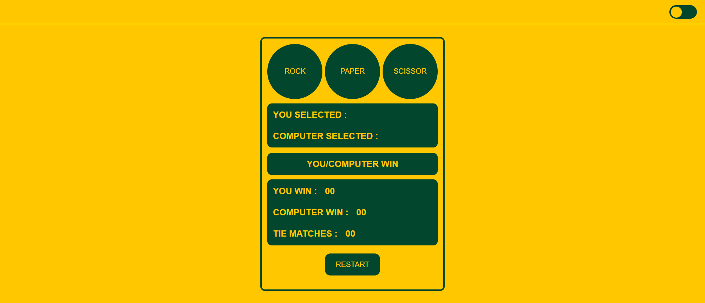

# 🎮 Rock Paper Scissors Game

A simple and interactive Rock Paper Scissors game developed using **HTML**, **CSS**, and **JavaScript**. The game allows users to play against the computer while tracking wins, losses, and ties. It also includes a Light/Dark Mode toggle for a better user experience.

## 🚀 Features

- ✨ Clean and responsive UI
- 🎲 Random computer move generation
- 📊 Live score tracking
- 🔄 Restart game functionality
- 🌗 Light/Dark Mode toggle
- ⚡ Fast and lightweight (No external libraries)

## 🛠️ Technologies Used

- HTML5
- CSS3
- JavaScript (ES6)

## 📂 Project Structure

```
Rock-Paper-Scissors-Game/
│── index.html
│── style.css
│── script.js
└── README.md
```

## 🎯 How to Play

1. Open `index.html` in your browser.
2. Choose one of the three options:
   - 🪨 Rock
   - 📄 Paper
   - ✂️ Scissors
3. The computer will randomly select its move.
4. The result will be displayed instantly.
5. Scores are updated automatically.
6. Click **Restart** to reset the game.

## 💡 Features Included

- Player vs Computer gameplay
- Randomized computer choices
- Win/Loss/Tie detection
- Scoreboard
- Theme switching (Light/Dark Mode)
- Responsive layout

## 📸 Preview



## 👨‍💻 Author

**Maulik Dabhi**

If you like this project, don't forget to ⭐ the repository!
